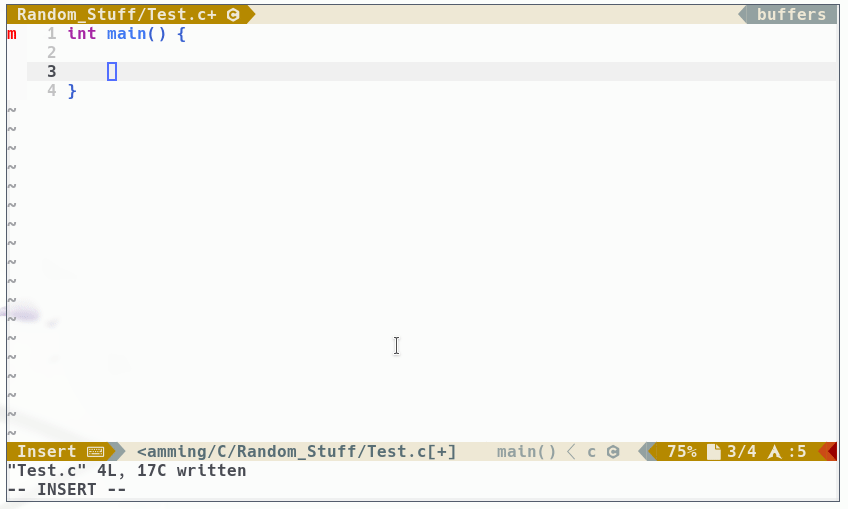

# Hint
This is only a forked for me and my friends! But you can still use it if you
want.

# Difference to original
The main focus on this plugin is that the plugin places the semicolons (`;`),
commas (`,`) and double points (`:`) **automatically** for you.

# Demo

I didn't type the semicolon key! Every semicolon is places automatically with
cosco.

# Installing
[vim-plug](https://github.com/junegunn/vim-plug):

```vim
" HINT: DON'T USE THE DEV BRANCH YET! auto-cosco is not ready yet to call
" it 'stable'. So I'm using the stable branch for all changes currently.
Plug 'TornaxO7/auto-cosco.vim', {'branch' : 'stable'}
```

# How to use
Please take a look into the `:h cosco` documentation.

# Contributing
Thank you for considering to contribute to this plugin :) Take a look into
[into the documentation](CONTRIBUTING.md) which is extra made if you want to
understand the structure and code of `auto-cosco`.

# Credits
Thanks to [lfilho](https://github.com/lfilho) the original plugin writer of
[cosco](https://github.com/lfilho/cosco.vim).
